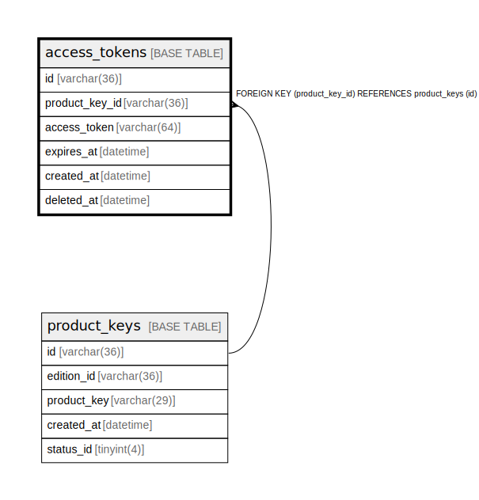

# access_tokens

## Description

<details>
<summary><strong>Table Definition</strong></summary>

```sql
CREATE TABLE `access_tokens` (
  `id` varchar(36) NOT NULL,
  `product_key_id` varchar(36) NOT NULL,
  `access_token` varchar(64) NOT NULL,
  `expires_at` datetime NOT NULL,
  `created_at` datetime NOT NULL DEFAULT current_timestamp(),
  `deleted_at` datetime DEFAULT NULL,
  PRIMARY KEY (`id`),
  UNIQUE KEY `uni_access_tokens_access_token` (`access_token`),
  KEY `fk_product_keys_access_tokens` (`product_key_id`),
  CONSTRAINT `fk_product_keys_access_tokens` FOREIGN KEY (`product_key_id`) REFERENCES `product_keys` (`id`)
) ENGINE=InnoDB DEFAULT CHARSET=utf8mb4
```

</details>

## Columns

| Name | Type | Default | Nullable | Children | Parents | Comment |
| ---- | ---- | ------- | -------- | -------- | ------- | ------- |
| id | varchar(36) |  | false |  |  |  |
| product_key_id | varchar(36) |  | false |  | [product_keys](product_keys.md) |  |
| access_token | varchar(64) |  | false |  |  |  |
| expires_at | datetime |  | false |  |  |  |
| created_at | datetime | current_timestamp() | false |  |  |  |
| deleted_at | datetime | NULL | true |  |  |  |

## Constraints

| Name | Type | Definition |
| ---- | ---- | ---------- |
| fk_product_keys_access_tokens | FOREIGN KEY | FOREIGN KEY (product_key_id) REFERENCES product_keys (id) |
| PRIMARY | PRIMARY KEY | PRIMARY KEY (id) |
| uni_access_tokens_access_token | UNIQUE | UNIQUE KEY uni_access_tokens_access_token (access_token) |

## Indexes

| Name | Definition |
| ---- | ---------- |
| fk_product_keys_access_tokens | KEY fk_product_keys_access_tokens (product_key_id) USING BTREE |
| PRIMARY | PRIMARY KEY (id) USING BTREE |
| uni_access_tokens_access_token | UNIQUE KEY uni_access_tokens_access_token (access_token) USING BTREE |

## Relations



---

> Generated by [tbls](https://github.com/k1LoW/tbls)
