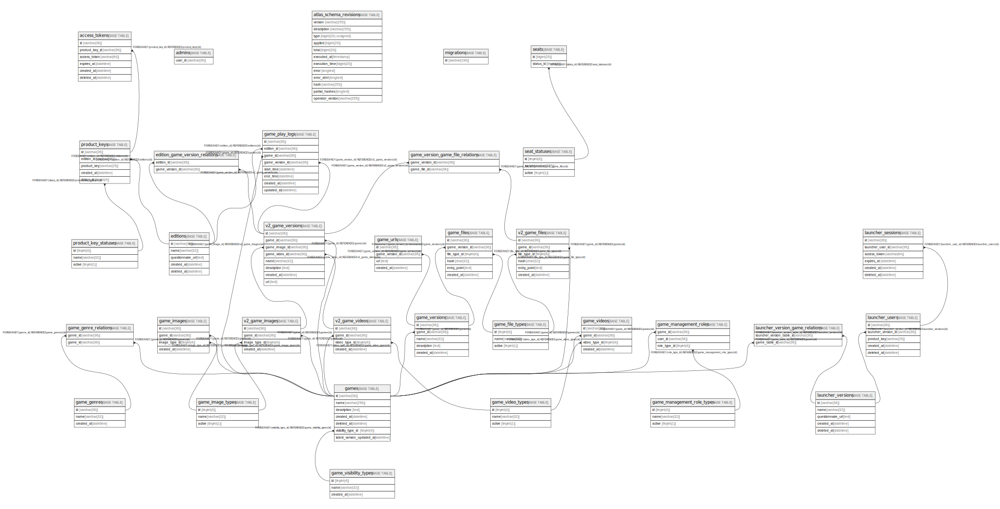

# trap_collection

## Tables

| Name | Columns | Comment | Type |
| ---- | ------- | ------- | ---- |
| [access_tokens](access_tokens.md) | 6 | アクセストークンテーブル(v2) | BASE TABLE |
| [admins](admins.md) | 1 |  | BASE TABLE |
| [atlas_schema_revisions](atlas_schema_revisions.md) | 12 |  | BASE TABLE |
| [editions](editions.md) | 5 | エディションテーブル(v2) | BASE TABLE |
| [edition_game_version_relations](edition_game_version_relations.md) | 2 | エディションとゲームバージョンの関係テーブル(v2) | BASE TABLE |
| [feedback_questions](feedback_questions.md) | 5 |  | BASE TABLE |
| [games](games.md) | 7 | ゲームテーブル | BASE TABLE |
| [game_creators](game_creators.md) | 5 |  | BASE TABLE |
| [game_creator_custom_jobs](game_creator_custom_jobs.md) | 4 |  | BASE TABLE |
| [game_creator_custom_job_relations](game_creator_custom_job_relations.md) | 2 |  | BASE TABLE |
| [game_creator_jobs](game_creator_jobs.md) | 3 |  | BASE TABLE |
| [game_creator_job_relations](game_creator_job_relations.md) | 2 |  | BASE TABLE |
| [game_feedbacks](game_feedbacks.md) | 5 |  | BASE TABLE |
| [game_feedback_answers](game_feedback_answers.md) | 4 |  | BASE TABLE |
| [game_files](game_files.md) | 6 | ゲームファイルテーブル(v1) | BASE TABLE |
| [game_file_types](game_file_types.md) | 3 | ゲームファイルの種類のテーブル | BASE TABLE |
| [game_genres](game_genres.md) | 3 | ゲームのジャンルのテーブル | BASE TABLE |
| [game_genre_relations](game_genre_relations.md) | 2 | ゲームとジャンルの関係テーブル | BASE TABLE |
| [game_images](game_images.md) | 4 | ゲーム画像テーブル(v1) | BASE TABLE |
| [game_image_types](game_image_types.md) | 3 | ゲーム画像の種類のテーブル | BASE TABLE |
| [game_management_roles](game_management_roles.md) | 3 | ゲーム管理者の権限のテーブル | BASE TABLE |
| [game_management_role_types](game_management_role_types.md) | 3 | ゲーム管理者の権限の種類のテーブル | BASE TABLE |
| [game_play_logs](game_play_logs.md) | 9 |  | BASE TABLE |
| [game_urls](game_urls.md) | 4 | ゲームURLテーブル(v1) | BASE TABLE |
| [game_versions](game_versions.md) | 5 | ゲームバージョンテーブル(v1) | BASE TABLE |
| [game_version_game_file_relations](game_version_game_file_relations.md) | 2 | ゲームバージョンとゲームファイルの関係テーブル(v2) | BASE TABLE |
| [game_videos](game_videos.md) | 4 | ゲーム動画テーブル(v1) | BASE TABLE |
| [game_video_types](game_video_types.md) | 3 | ゲーム動画の種類のテーブル | BASE TABLE |
| [game_visibility_types](game_visibility_types.md) | 3 | ゲームの公開範囲のテーブル | BASE TABLE |
| [launcher_sessions](launcher_sessions.md) | 6 | ランチャーセッションテーブル(v1) | BASE TABLE |
| [launcher_users](launcher_users.md) | 5 | ランチャーユーザーテーブル(v1) | BASE TABLE |
| [launcher_versions](launcher_versions.md) | 5 | ランチャーバージョンテーブル(v1) | BASE TABLE |
| [launcher_version_game_relations](launcher_version_game_relations.md) | 2 | ランチャーバージョンとゲームの関係テーブル(v1) | BASE TABLE |
| [migrations](migrations.md) | 1 | マイグレーションテーブル(gormigrate) | BASE TABLE |
| [product_keys](product_keys.md) | 5 | プロダクトキーテーブル(v2) | BASE TABLE |
| [product_key_statuses](product_key_statuses.md) | 3 | プロダクトキーのステータスのテーブル | BASE TABLE |
| [seats](seats.md) | 2 |  | BASE TABLE |
| [seat_statuses](seat_statuses.md) | 3 |  | BASE TABLE |
| [v2_game_files](v2_game_files.md) | 6 | ゲームファイルテーブル(v2) | BASE TABLE |
| [v2_game_images](v2_game_images.md) | 4 | ゲーム画像テーブル(v2) | BASE TABLE |
| [v2_game_versions](v2_game_versions.md) | 8 | ゲームバージョンテーブル(v2) | BASE TABLE |
| [v2_game_videos](v2_game_videos.md) | 4 | ゲーム動画テーブル(v2) | BASE TABLE |

## Relations

---

> Generated by [tbls](https://github.com/k1LoW/tbls)
