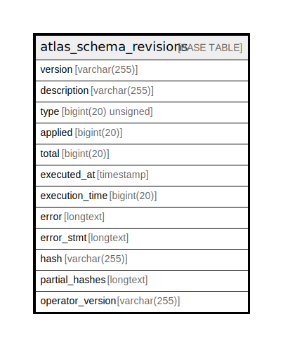

# atlas_schema_revisions

## Description

<details>
<summary><strong>Table Definition</strong></summary>

```sql
CREATE TABLE `atlas_schema_revisions` (
  `version` varchar(255) COLLATE utf8mb4_bin NOT NULL,
  `description` varchar(255) COLLATE utf8mb4_bin NOT NULL,
  `type` bigint(20) unsigned NOT NULL DEFAULT 2,
  `applied` bigint(20) NOT NULL DEFAULT 0,
  `total` bigint(20) NOT NULL DEFAULT 0,
  `executed_at` timestamp NULL DEFAULT NULL,
  `execution_time` bigint(20) NOT NULL,
  `error` longtext COLLATE utf8mb4_bin DEFAULT NULL,
  `error_stmt` longtext COLLATE utf8mb4_bin DEFAULT NULL,
  `hash` varchar(255) COLLATE utf8mb4_bin NOT NULL,
  `partial_hashes` longtext COLLATE utf8mb4_bin DEFAULT NULL CHECK (json_valid(`partial_hashes`)),
  `operator_version` varchar(255) COLLATE utf8mb4_bin NOT NULL,
  PRIMARY KEY (`version`)
) ENGINE=InnoDB DEFAULT CHARSET=utf8mb4 COLLATE=utf8mb4_bin
```

</details>

## Columns

| Name | Type | Default | Nullable | Children | Parents | Comment |
| ---- | ---- | ------- | -------- | -------- | ------- | ------- |
| version | varchar(255) |  | false |  |  |  |
| description | varchar(255) |  | false |  |  |  |
| type | bigint(20) unsigned | 2 | false |  |  |  |
| applied | bigint(20) | 0 | false |  |  |  |
| total | bigint(20) | 0 | false |  |  |  |
| executed_at | timestamp | NULL | true |  |  |  |
| execution_time | bigint(20) |  | false |  |  |  |
| error | longtext | NULL | true |  |  |  |
| error_stmt | longtext | NULL | true |  |  |  |
| hash | varchar(255) |  | false |  |  |  |
| partial_hashes | longtext | NULL | true |  |  |  |
| operator_version | varchar(255) |  | false |  |  |  |

## Constraints

| Name | Type | Definition |
| ---- | ---- | ---------- |
| PRIMARY | PRIMARY KEY | PRIMARY KEY (version) |

## Indexes

| Name | Definition |
| ---- | ---------- |
| PRIMARY | PRIMARY KEY (version) USING BTREE |

## Relations



---

> Generated by [tbls](https://github.com/k1LoW/tbls)
