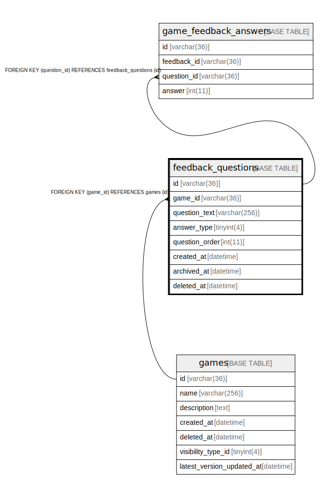

# feedback_questions

## Description

<details>
<summary><strong>Table Definition</strong></summary>

```sql
CREATE TABLE `feedback_questions` (
  `id` varchar(36) NOT NULL,
  `question_text` varchar(256) NOT NULL,
  `question_order` bigint(20) NOT NULL,
  `is_active` tinyint(1) NOT NULL DEFAULT 1,
  `created_at` datetime NOT NULL DEFAULT current_timestamp(),
  PRIMARY KEY (`id`)
) ENGINE=InnoDB DEFAULT CHARSET=utf8mb4
```

</details>

## Columns

| Name | Type | Default | Nullable | Children | Parents | Comment |
| ---- | ---- | ------- | -------- | -------- | ------- | ------- |
| id | varchar(36) |  | false | [game_feedback_answers](game_feedback_answers.md) |  |  |
| question_text | varchar(256) |  | false |  |  |  |
| question_order | bigint(20) |  | false |  |  |  |
| is_active | tinyint(1) | 1 | false |  |  |  |
| created_at | datetime | current_timestamp() | false |  |  |  |

## Constraints

| Name | Type | Definition |
| ---- | ---- | ---------- |
| PRIMARY | PRIMARY KEY | PRIMARY KEY (id) |

## Indexes

| Name | Definition |
| ---- | ---------- |
| PRIMARY | PRIMARY KEY (id) USING BTREE |

## Relations



---

> Generated by [tbls](https://github.com/k1LoW/tbls)
