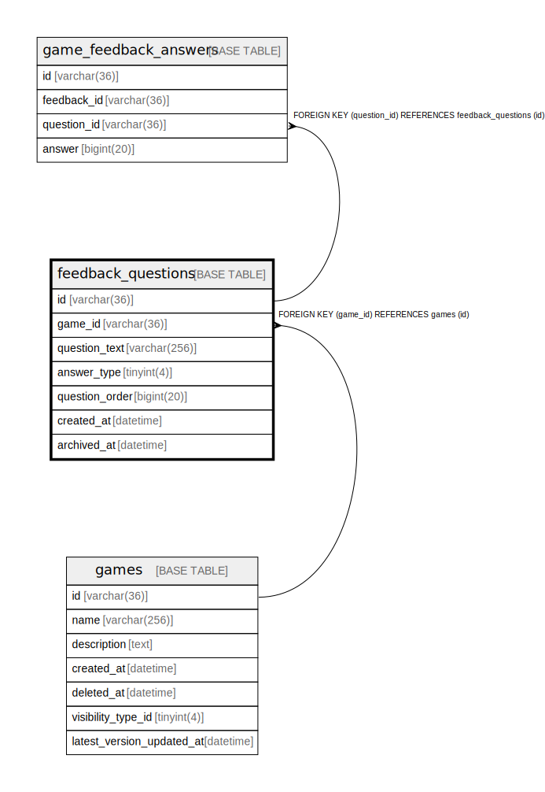

# feedback_questions

## Description

<details>
<summary><strong>Table Definition</strong></summary>

```sql
CREATE TABLE `feedback_questions` (
  `id` varchar(36) NOT NULL,
  `edition_id` varchar(36) NOT NULL,
  `game_id` varchar(36) NOT NULL,
  `question_text` varchar(256) NOT NULL,
  `answer_type` tinyint(4) NOT NULL,
  `question_order` bigint(20) NOT NULL,
  `created_at` datetime NOT NULL DEFAULT current_timestamp(),
  `deleted_at` datetime DEFAULT NULL,
  PRIMARY KEY (`id`),
  KEY `fk_feedback_questions_game` (`game_id`),
  KEY `idx_edition_game` (`edition_id`,`game_id`),
  CONSTRAINT `fk_feedback_questions_edition` FOREIGN KEY (`edition_id`) REFERENCES `editions` (`id`),
  CONSTRAINT `fk_feedback_questions_game` FOREIGN KEY (`game_id`) REFERENCES `games` (`id`)
) ENGINE=InnoDB DEFAULT CHARSET=utf8mb4
```

</details>

## Columns

| Name | Type | Default | Nullable | Children | Parents | Comment |
| ---- | ---- | ------- | -------- | -------- | ------- | ------- |
| id | varchar(36) |  | false | [game_feedback_answers](game_feedback_answers.md) |  |  |
| edition_id | varchar(36) |  | false |  | [editions](editions.md) |  |
| game_id | varchar(36) |  | false |  | [games](games.md) |  |
| question_text | varchar(256) |  | false |  |  |  |
| answer_type | tinyint(4) |  | false |  |  |  |
| question_order | bigint(20) |  | false |  |  |  |
| created_at | datetime | current_timestamp() | false |  |  |  |
| deleted_at | datetime | NULL | true |  |  |  |

## Constraints

| Name | Type | Definition |
| ---- | ---- | ---------- |
| fk_feedback_questions_edition | FOREIGN KEY | FOREIGN KEY (edition_id) REFERENCES editions (id) |
| fk_feedback_questions_game | FOREIGN KEY | FOREIGN KEY (game_id) REFERENCES games (id) |
| PRIMARY | PRIMARY KEY | PRIMARY KEY (id) |

## Indexes

| Name | Definition |
| ---- | ---------- |
| fk_feedback_questions_game | KEY fk_feedback_questions_game (game_id) USING BTREE |
| idx_edition_game | KEY idx_edition_game (edition_id, game_id) USING BTREE |
| PRIMARY | PRIMARY KEY (id) USING BTREE |

## Relations



---

> Generated by [tbls](https://github.com/k1LoW/tbls)
