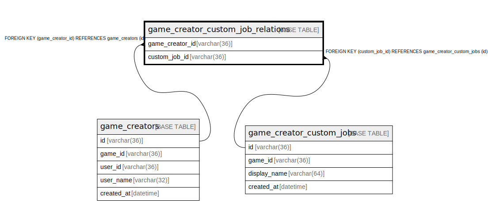

# game_creator_custom_job_relations

## Description

<details>
<summary><strong>Table Definition</strong></summary>

```sql
CREATE TABLE `game_creator_custom_job_relations` (
  `game_creator_id` varchar(36) NOT NULL,
  `custom_job_id` varchar(36) NOT NULL,
  PRIMARY KEY (`game_creator_id`,`custom_job_id`),
  KEY `fk_game_creator_custom_job_relations_game_creator_customa6516cf7` (`custom_job_id`),
  CONSTRAINT `fk_game_creator_custom_job_relations_game_creator_customa6516cf7` FOREIGN KEY (`custom_job_id`) REFERENCES `game_creator_custom_jobs` (`id`),
  CONSTRAINT `fk_game_creator_custom_job_relations_game_creator_table` FOREIGN KEY (`game_creator_id`) REFERENCES `game_creators` (`id`)
) ENGINE=InnoDB DEFAULT CHARSET=utf8mb4
```

</details>

## Columns

| Name | Type | Default | Nullable | Children | Parents | Comment |
| ---- | ---- | ------- | -------- | -------- | ------- | ------- |
| game_creator_id | varchar(36) |  | false |  | [game_creators](game_creators.md) |  |
| custom_job_id | varchar(36) |  | false |  | [game_creator_custom_jobs](game_creator_custom_jobs.md) |  |

## Constraints

| Name | Type | Definition |
| ---- | ---- | ---------- |
| fk_game_creator_custom_job_relations_game_creator_customa6516cf7 | FOREIGN KEY | FOREIGN KEY (custom_job_id) REFERENCES game_creator_custom_jobs (id) |
| fk_game_creator_custom_job_relations_game_creator_table | FOREIGN KEY | FOREIGN KEY (game_creator_id) REFERENCES game_creators (id) |
| PRIMARY | PRIMARY KEY | PRIMARY KEY (game_creator_id, custom_job_id) |

## Indexes

| Name | Definition |
| ---- | ---------- |
| fk_game_creator_custom_job_relations_game_creator_customa6516cf7 | KEY fk_game_creator_custom_job_relations_game_creator_customa6516cf7 (custom_job_id) USING BTREE |
| PRIMARY | PRIMARY KEY (game_creator_id, custom_job_id) USING BTREE |

## Relations



---

> Generated by [tbls](https://github.com/k1LoW/tbls)
