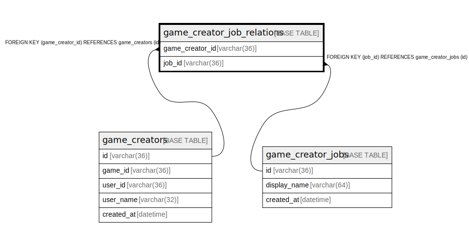

# game_creator_job_relations

## Description

<details>
<summary><strong>Table Definition</strong></summary>

```sql
CREATE TABLE `game_creator_job_relations` (
  `game_creator_id` varchar(36) NOT NULL,
  `job_id` varchar(36) NOT NULL,
  PRIMARY KEY (`game_creator_id`,`job_id`),
  KEY `fk_game_creator_job_relations_game_creator_job_table` (`job_id`),
  CONSTRAINT `fk_game_creator_job_relations_game_creator_job_table` FOREIGN KEY (`job_id`) REFERENCES `game_creator_jobs` (`id`),
  CONSTRAINT `fk_game_creator_job_relations_game_creator_table` FOREIGN KEY (`game_creator_id`) REFERENCES `game_creators` (`id`)
) ENGINE=InnoDB DEFAULT CHARSET=utf8mb4
```

</details>

## Columns

| Name | Type | Default | Nullable | Children | Parents | Comment |
| ---- | ---- | ------- | -------- | -------- | ------- | ------- |
| game_creator_id | varchar(36) |  | false |  | [game_creators](game_creators.md) |  |
| job_id | varchar(36) |  | false |  | [game_creator_jobs](game_creator_jobs.md) |  |

## Constraints

| Name | Type | Definition |
| ---- | ---- | ---------- |
| fk_game_creator_job_relations_game_creator_job_table | FOREIGN KEY | FOREIGN KEY (job_id) REFERENCES game_creator_jobs (id) |
| fk_game_creator_job_relations_game_creator_table | FOREIGN KEY | FOREIGN KEY (game_creator_id) REFERENCES game_creators (id) |
| PRIMARY | PRIMARY KEY | PRIMARY KEY (game_creator_id, job_id) |

## Indexes

| Name | Definition |
| ---- | ---------- |
| fk_game_creator_job_relations_game_creator_job_table | KEY fk_game_creator_job_relations_game_creator_job_table (job_id) USING BTREE |
| PRIMARY | PRIMARY KEY (game_creator_id, job_id) USING BTREE |

## Relations



---

> Generated by [tbls](https://github.com/k1LoW/tbls)
