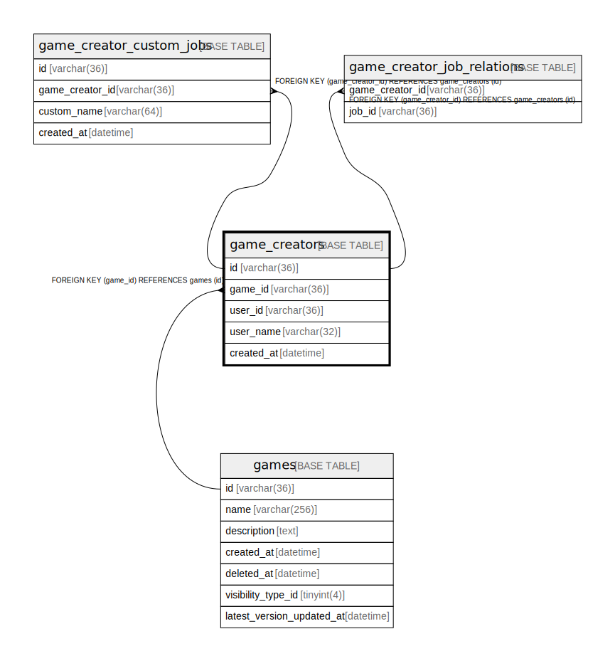

# game_creators

## Description

<details>
<summary><strong>Table Definition</strong></summary>

```sql
CREATE TABLE `game_creators` (
  `id` varchar(36) NOT NULL,
  `game_id` varchar(36) NOT NULL,
  `user_id` varchar(36) NOT NULL,
  `user_name` varchar(32) NOT NULL,
  `created_at` datetime NOT NULL DEFAULT current_timestamp(),
  PRIMARY KEY (`id`),
  UNIQUE KEY `idx_unique_game_id_user_id` (`game_id`,`user_id`),
  KEY `idx_game_creators_game_id` (`game_id`),
  CONSTRAINT `fk_game_creators_game` FOREIGN KEY (`game_id`) REFERENCES `games` (`id`)
) ENGINE=InnoDB DEFAULT CHARSET=utf8mb4
```

</details>

## Columns

| Name | Type | Default | Nullable | Children | Parents | Comment |
| ---- | ---- | ------- | -------- | -------- | ------- | ------- |
| id | varchar(36) |  | false | [game_creator_custom_jobs](game_creator_custom_jobs.md) [game_creator_job_relations](game_creator_job_relations.md) |  |  |
| game_id | varchar(36) |  | false |  | [games](games.md) |  |
| user_id | varchar(36) |  | false |  |  |  |
| user_name | varchar(32) |  | false |  |  |  |
| created_at | datetime | current_timestamp() | false |  |  |  |

## Constraints

| Name | Type | Definition |
| ---- | ---- | ---------- |
| fk_game_creators_game | FOREIGN KEY | FOREIGN KEY (game_id) REFERENCES games (id) |
| idx_unique_game_id_user_id | UNIQUE | UNIQUE KEY idx_unique_game_id_user_id (game_id, user_id) |
| PRIMARY | PRIMARY KEY | PRIMARY KEY (id) |

## Indexes

| Name | Definition |
| ---- | ---------- |
| idx_game_creators_game_id | KEY idx_game_creators_game_id (game_id) USING BTREE |
| PRIMARY | PRIMARY KEY (id) USING BTREE |
| idx_unique_game_id_user_id | UNIQUE KEY idx_unique_game_id_user_id (game_id, user_id) USING BTREE |

## Relations



---

> Generated by [tbls](https://github.com/k1LoW/tbls)
