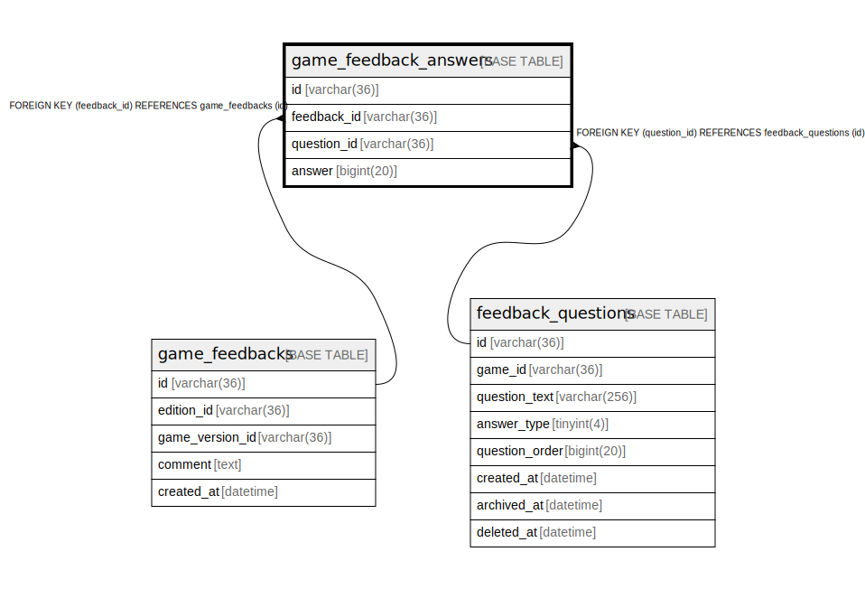

# game_feedback_answers

## Description

<details>
<summary><strong>Table Definition</strong></summary>

```sql
CREATE TABLE `game_feedback_answers` (
  `id` varchar(36) NOT NULL,
  `feedback_id` varchar(36) NOT NULL,
  `question_id` varchar(36) NOT NULL,
  `answer` tinyint(1) NOT NULL,
  PRIMARY KEY (`id`),
  KEY `idx_game_feedback_answers_feedback_id` (`feedback_id`),
  KEY `idx_game_feedback_answers_question_id` (`question_id`),
  CONSTRAINT `fk_game_feedback_answers_question` FOREIGN KEY (`question_id`) REFERENCES `feedback_questions` (`id`),
  CONSTRAINT `fk_game_feedbacks_answers` FOREIGN KEY (`feedback_id`) REFERENCES `game_feedbacks` (`id`)
) ENGINE=InnoDB DEFAULT CHARSET=utf8mb4
```

</details>

## Columns

| Name | Type | Default | Nullable | Children | Parents | Comment |
| ---- | ---- | ------- | -------- | -------- | ------- | ------- |
| id | varchar(36) |  | false |  |  |  |
| feedback_id | varchar(36) |  | false |  | [game_feedbacks](game_feedbacks.md) |  |
| question_id | varchar(36) |  | false |  | [feedback_questions](feedback_questions.md) |  |
| answer | tinyint(1) |  | false |  |  |  |

## Constraints

| Name | Type | Definition |
| ---- | ---- | ---------- |
| fk_game_feedbacks_answers | FOREIGN KEY | FOREIGN KEY (feedback_id) REFERENCES game_feedbacks (id) |
| fk_game_feedback_answers_question | FOREIGN KEY | FOREIGN KEY (question_id) REFERENCES feedback_questions (id) |
| PRIMARY | PRIMARY KEY | PRIMARY KEY (id) |

## Indexes

| Name | Definition |
| ---- | ---------- |
| idx_game_feedback_answers_feedback_id | KEY idx_game_feedback_answers_feedback_id (feedback_id) USING BTREE |
| idx_game_feedback_answers_question_id | KEY idx_game_feedback_answers_question_id (question_id) USING BTREE |
| PRIMARY | PRIMARY KEY (id) USING BTREE |

## Relations



---

> Generated by [tbls](https://github.com/k1LoW/tbls)
