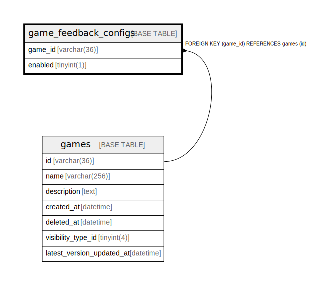

# game_feedback_configs

## Description

<details>
<summary><strong>Table Definition</strong></summary>

```sql
CREATE TABLE `game_feedback_configs` (
  `edition_id` varchar(36) NOT NULL,
  `game_id` varchar(36) NOT NULL,
  `enabled` tinyint(1) NOT NULL DEFAULT 0,
  PRIMARY KEY (`edition_id`,`game_id`),
  KEY `fk_game_feedback_configs_game` (`game_id`),
  CONSTRAINT `fk_game_feedback_configs_edition` FOREIGN KEY (`edition_id`) REFERENCES `editions` (`id`),
  CONSTRAINT `fk_game_feedback_configs_game` FOREIGN KEY (`game_id`) REFERENCES `games` (`id`)
) ENGINE=InnoDB DEFAULT CHARSET=utf8mb4
```

</details>

## Columns

| Name | Type | Default | Nullable | Children | Parents | Comment |
| ---- | ---- | ------- | -------- | -------- | ------- | ------- |
| edition_id | varchar(36) |  | false |  | [editions](editions.md) |  |
| game_id | varchar(36) |  | false |  | [games](games.md) |  |
| enabled | tinyint(1) | 0 | false |  |  |  |

## Constraints

| Name | Type | Definition |
| ---- | ---- | ---------- |
| fk_game_feedback_configs_edition | FOREIGN KEY | FOREIGN KEY (edition_id) REFERENCES editions (id) |
| fk_game_feedback_configs_game | FOREIGN KEY | FOREIGN KEY (game_id) REFERENCES games (id) |
| PRIMARY | PRIMARY KEY | PRIMARY KEY (edition_id, game_id) |

## Indexes

| Name | Definition |
| ---- | ---------- |
| fk_game_feedback_configs_game | KEY fk_game_feedback_configs_game (game_id) USING BTREE |
| PRIMARY | PRIMARY KEY (edition_id, game_id) USING BTREE |

## Relations



---

> Generated by [tbls](https://github.com/k1LoW/tbls)
