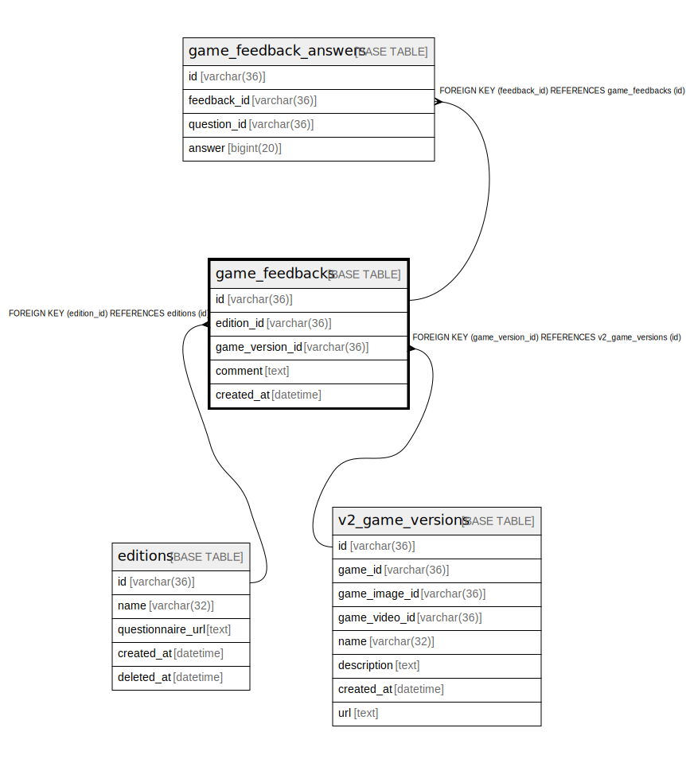

# game_feedbacks

## Description

<details>
<summary><strong>Table Definition</strong></summary>

```sql
CREATE TABLE `game_feedbacks` (
  `id` varchar(36) NOT NULL,
  `edition_id` varchar(36) NOT NULL,
  `game_version_id` varchar(36) NOT NULL,
  `comment` text DEFAULT NULL,
  `created_at` datetime NOT NULL DEFAULT current_timestamp(),
  PRIMARY KEY (`id`),
  KEY `idx_game_feedbacks_edition_id` (`edition_id`),
  KEY `idx_game_feedbacks_game_version_id` (`game_version_id`),
  CONSTRAINT `fk_game_feedbacks_edition` FOREIGN KEY (`edition_id`) REFERENCES `editions` (`id`),
  CONSTRAINT `fk_game_feedbacks_game_version` FOREIGN KEY (`game_version_id`) REFERENCES `v2_game_versions` (`id`)
) ENGINE=InnoDB DEFAULT CHARSET=utf8mb4
```

</details>

## Columns

| Name | Type | Default | Nullable | Children | Parents | Comment |
| ---- | ---- | ------- | -------- | -------- | ------- | ------- |
| id | varchar(36) |  | false | [game_feedback_answers](game_feedback_answers.md) |  |  |
| edition_id | varchar(36) |  | false |  | [editions](editions.md) |  |
| game_version_id | varchar(36) |  | false |  | [v2_game_versions](v2_game_versions.md) |  |
| comment | text | NULL | true |  |  |  |
| created_at | datetime | current_timestamp() | false |  |  |  |

## Constraints

| Name | Type | Definition |
| ---- | ---- | ---------- |
| fk_game_feedbacks_edition | FOREIGN KEY | FOREIGN KEY (edition_id) REFERENCES editions (id) |
| fk_game_feedbacks_game_version | FOREIGN KEY | FOREIGN KEY (game_version_id) REFERENCES v2_game_versions (id) |
| PRIMARY | PRIMARY KEY | PRIMARY KEY (id) |

## Indexes

| Name | Definition |
| ---- | ---------- |
| idx_game_feedbacks_edition_id | KEY idx_game_feedbacks_edition_id (edition_id) USING BTREE |
| idx_game_feedbacks_game_version_id | KEY idx_game_feedbacks_game_version_id (game_version_id) USING BTREE |
| PRIMARY | PRIMARY KEY (id) USING BTREE |

## Relations



---

> Generated by [tbls](https://github.com/k1LoW/tbls)
