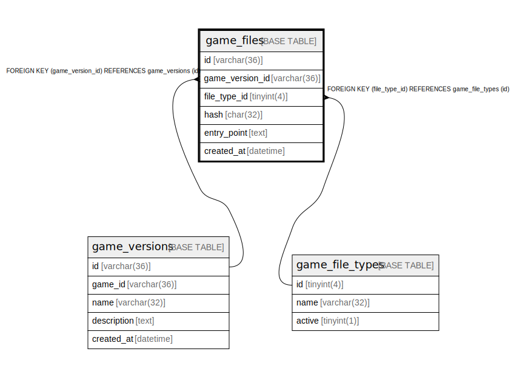

# game_files

## Description

ゲームファイルテーブル(v1)

<details>
<summary><strong>Table Definition</strong></summary>

```sql
CREATE TABLE `game_files` (
  `id` varchar(36) NOT NULL,
  `game_version_id` varchar(36) NOT NULL,
  `file_type_id` tinyint(4) NOT NULL,
  `hash` char(32) NOT NULL,
  `entry_point` text NOT NULL,
  `created_at` datetime NOT NULL DEFAULT current_timestamp(),
  PRIMARY KEY (`id`),
  UNIQUE KEY `idx_game_file_unique` (`game_version_id`,`file_type_id`),
  KEY `fk_game_files_game_file_type` (`file_type_id`),
  CONSTRAINT `fk_game_files_game_file_type` FOREIGN KEY (`file_type_id`) REFERENCES `game_file_types` (`id`),
  CONSTRAINT `fk_game_versions_game_files` FOREIGN KEY (`game_version_id`) REFERENCES `game_versions` (`id`)
) ENGINE=InnoDB DEFAULT CHARSET=utf8mb4
```

</details>

## Columns

| Name | Type | Default | Nullable | Children | Parents | Comment |
| ---- | ---- | ------- | -------- | -------- | ------- | ------- |
| id | varchar(36) |  | false |  |  | ゲームファイルUUID |
| game_version_id | varchar(36) |  | false |  | [game_versions](game_versions.md) | ゲームバージョンUUID |
| file_type_id | tinyint(4) |  | false |  | [game_file_types](game_file_types.md) | ファイルの種類のUUID |
| hash | char(32) |  | false |  |  | ファイルのmd5ハッシュ |
| entry_point | text |  | false |  |  | ファイル実行時のエントリーポイント |
| created_at | datetime | current_timestamp() | false |  |  | 作成日時 |

## Constraints

| Name | Type | Definition |
| ---- | ---- | ---------- |
| fk_game_files_game_file_type | FOREIGN KEY | FOREIGN KEY (file_type_id) REFERENCES game_file_types (id) |
| fk_game_versions_game_files | FOREIGN KEY | FOREIGN KEY (game_version_id) REFERENCES game_versions (id) |
| idx_game_file_unique | UNIQUE | UNIQUE KEY idx_game_file_unique (game_version_id, file_type_id) |
| PRIMARY | PRIMARY KEY | PRIMARY KEY (id) |

## Indexes

| Name | Definition |
| ---- | ---------- |
| fk_game_files_game_file_type | KEY fk_game_files_game_file_type (file_type_id) USING BTREE |
| PRIMARY | PRIMARY KEY (id) USING BTREE |
| idx_game_file_unique | UNIQUE KEY idx_game_file_unique (game_version_id, file_type_id) USING BTREE |

## Relations



---

> Generated by [tbls](https://github.com/k1LoW/tbls)
