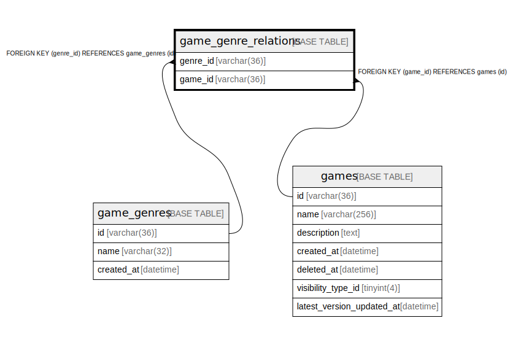

# game_genre_relations

## Description

<details>
<summary><strong>Table Definition</strong></summary>

```sql
CREATE TABLE `game_genre_relations` (
  `genre_id` varchar(36) NOT NULL,
  `game_id` varchar(36) NOT NULL,
  PRIMARY KEY (`genre_id`,`game_id`),
  KEY `fk_game_genre_relations_game_table2_v5` (`game_id`),
  CONSTRAINT `fk_game_genre_relations_game_genre_table_v10` FOREIGN KEY (`genre_id`) REFERENCES `game_genres` (`id`),
  CONSTRAINT `fk_game_genre_relations_game_table2_v5` FOREIGN KEY (`game_id`) REFERENCES `games` (`id`)
) ENGINE=InnoDB DEFAULT CHARSET=utf8mb4
```

</details>

## Columns

| Name | Type | Default | Nullable | Children | Parents | Comment |
| ---- | ---- | ------- | -------- | -------- | ------- | ------- |
| genre_id | varchar(36) |  | false |  | [game_genres](game_genres.md) |  |
| game_id | varchar(36) |  | false |  | [games](games.md) |  |

## Constraints

| Name | Type | Definition |
| ---- | ---- | ---------- |
| fk_game_genre_relations_game_genre_table_v10 | FOREIGN KEY | FOREIGN KEY (genre_id) REFERENCES game_genres (id) |
| fk_game_genre_relations_game_table2_v5 | FOREIGN KEY | FOREIGN KEY (game_id) REFERENCES games (id) |
| PRIMARY | PRIMARY KEY | PRIMARY KEY (genre_id, game_id) |

## Indexes

| Name | Definition |
| ---- | ---------- |
| fk_game_genre_relations_game_table2_v5 | KEY fk_game_genre_relations_game_table2_v5 (game_id) USING BTREE |
| PRIMARY | PRIMARY KEY (genre_id, game_id) USING BTREE |

## Relations



---

> Generated by [tbls](https://github.com/k1LoW/tbls)
