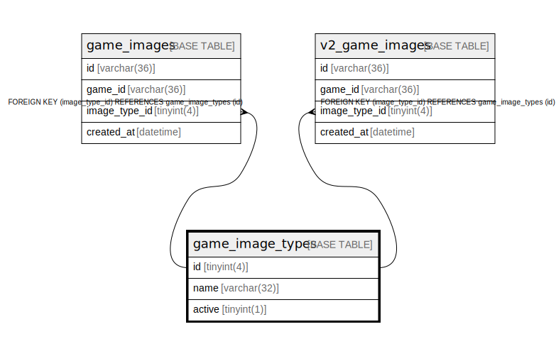

# game_image_types

## Description

ゲーム画像の種類のテーブル

<details>
<summary><strong>Table Definition</strong></summary>

```sql
CREATE TABLE `game_image_types` (
  `id` tinyint(4) NOT NULL AUTO_INCREMENT,
  `name` varchar(32) NOT NULL,
  `active` tinyint(1) DEFAULT 1,
  PRIMARY KEY (`id`),
  UNIQUE KEY `uni_game_image_types_name` (`name`)
) ENGINE=InnoDB AUTO_INCREMENT=[Redacted by tbls] DEFAULT CHARSET=utf8mb4
```

</details>

## Columns

| Name | Type | Default | Nullable | Extra Definition | Children | Parents | Comment |
| ---- | ---- | ------- | -------- | ---------------- | -------- | ------- | ------- |
| id | tinyint(4) |  | false | auto_increment | [game_images](game_images.md) [v2_game_images](v2_game_images.md) |  | ゲーム画像の種類のUUID |
| name | varchar(32) |  | false |  |  |  | ゲーム画像の種類の名前 |
| active | tinyint(1) | 1 | true |  |  |  | 有効かどうか |

## Constraints

| Name | Type | Definition |
| ---- | ---- | ---------- |
| PRIMARY | PRIMARY KEY | PRIMARY KEY (id) |
| uni_game_image_types_name | UNIQUE | UNIQUE KEY uni_game_image_types_name (name) |

## Indexes

| Name | Definition |
| ---- | ---------- |
| PRIMARY | PRIMARY KEY (id) USING BTREE |
| uni_game_image_types_name | UNIQUE KEY uni_game_image_types_name (name) USING BTREE |

## Relations



---

> Generated by [tbls](https://github.com/k1LoW/tbls)
