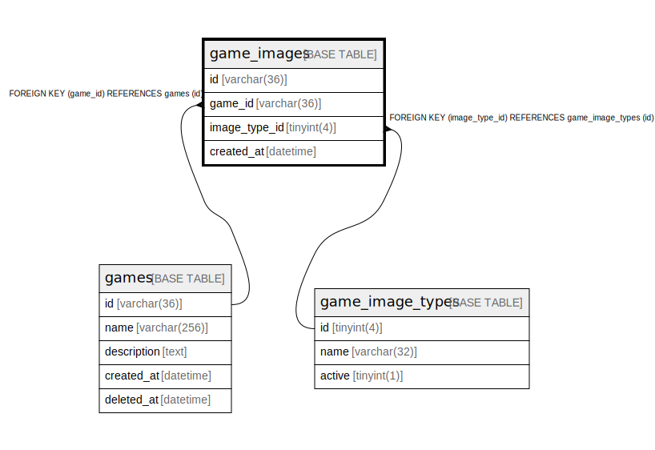

# game_images

## Description

ゲーム画像テーブル(v1)

<details>
<summary><strong>Table Definition</strong></summary>

```sql
CREATE TABLE `game_images` (
  `id` varchar(36) NOT NULL,
  `game_id` varchar(36) NOT NULL,
  `image_type_id` tinyint(4) NOT NULL,
  `created_at` datetime NOT NULL DEFAULT current_timestamp(),
  PRIMARY KEY (`id`),
  KEY `fk_games_game_images` (`game_id`),
  KEY `fk_game_images_game_image_type` (`image_type_id`),
  CONSTRAINT `fk_game_images_game_image_type` FOREIGN KEY (`image_type_id`) REFERENCES `game_image_types` (`id`),
  CONSTRAINT `fk_games_game_images` FOREIGN KEY (`game_id`) REFERENCES `games` (`id`)
) ENGINE=InnoDB DEFAULT CHARSET=utf8mb4
```

</details>

## Columns

| Name | Type | Default | Nullable | Children | Parents | Comment |
| ---- | ---- | ------- | -------- | -------- | ------- | ------- |
| id | varchar(36) |  | false |  |  | ゲーム画像UUID |
| game_id | varchar(36) |  | false |  | [games](games.md) | ゲームUUID |
| image_type_id | tinyint(4) |  | false |  | [game_image_types](game_image_types.md) | 画像の種類のUUID |
| created_at | datetime | current_timestamp() | false |  |  | 作成日時 |

## Constraints

| Name | Type | Definition |
| ---- | ---- | ---------- |
| fk_games_game_images | FOREIGN KEY | FOREIGN KEY (game_id) REFERENCES games (id) |
| fk_game_images_game_image_type | FOREIGN KEY | FOREIGN KEY (image_type_id) REFERENCES game_image_types (id) |
| PRIMARY | PRIMARY KEY | PRIMARY KEY (id) |

## Indexes

| Name | Definition |
| ---- | ---------- |
| fk_games_game_images | KEY fk_games_game_images (game_id) USING BTREE |
| fk_game_images_game_image_type | KEY fk_game_images_game_image_type (image_type_id) USING BTREE |
| PRIMARY | PRIMARY KEY (id) USING BTREE |

## Relations



---

> Generated by [tbls](https://github.com/k1LoW/tbls)
