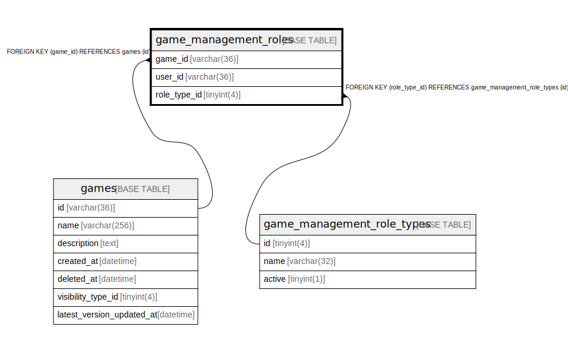

# game_management_roles

## Description

ゲーム管理者の権限のテーブル

<details>
<summary><strong>Table Definition</strong></summary>

```sql
CREATE TABLE `game_management_roles` (
  `game_id` varchar(36) NOT NULL,
  `user_id` varchar(36) NOT NULL,
  `role_type_id` tinyint(4) NOT NULL,
  PRIMARY KEY (`game_id`,`user_id`),
  KEY `fk_game_management_roles_role_type_table` (`role_type_id`),
  CONSTRAINT `fk_game_management_roles_role_type_table` FOREIGN KEY (`role_type_id`) REFERENCES `game_management_role_types` (`id`),
  CONSTRAINT `fk_games_game_management_roles` FOREIGN KEY (`game_id`) REFERENCES `games` (`id`)
) ENGINE=InnoDB DEFAULT CHARSET=utf8mb4
```

</details>

## Columns

| Name | Type | Default | Nullable | Children | Parents | Comment |
| ---- | ---- | ------- | -------- | -------- | ------- | ------- |
| game_id | varchar(36) |  | false |  | [games](games.md) | ゲームUUID |
| user_id | varchar(36) |  | false |  |  | ユーザーUUID |
| role_type_id | tinyint(4) |  | false |  | [game_management_role_types](game_management_role_types.md) | 権限の種類のUUID |

## Constraints

| Name | Type | Definition |
| ---- | ---- | ---------- |
| fk_games_game_management_roles | FOREIGN KEY | FOREIGN KEY (game_id) REFERENCES games (id) |
| fk_game_management_roles_role_type_table | FOREIGN KEY | FOREIGN KEY (role_type_id) REFERENCES game_management_role_types (id) |
| PRIMARY | PRIMARY KEY | PRIMARY KEY (game_id, user_id) |

## Indexes

| Name | Definition |
| ---- | ---------- |
| fk_game_management_roles_role_type_table | KEY fk_game_management_roles_role_type_table (role_type_id) USING BTREE |
| PRIMARY | PRIMARY KEY (game_id, user_id) USING BTREE |

## Relations



---

> Generated by [tbls](https://github.com/k1LoW/tbls)
