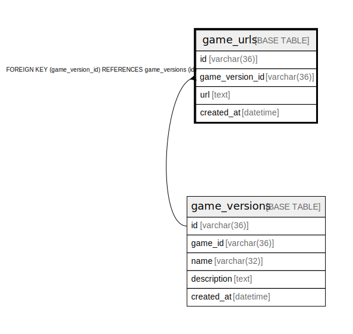

# game_urls

## Description

ゲームURLテーブル(v1)

<details>
<summary><strong>Table Definition</strong></summary>

```sql
CREATE TABLE `game_urls` (
  `id` varchar(36) NOT NULL,
  `game_version_id` varchar(36) NOT NULL,
  `url` text NOT NULL,
  `created_at` datetime NOT NULL DEFAULT current_timestamp(),
  PRIMARY KEY (`id`),
  UNIQUE KEY `game_version_id` (`game_version_id`),
  CONSTRAINT `fk_game_versions_game_url` FOREIGN KEY (`game_version_id`) REFERENCES `game_versions` (`id`)
) ENGINE=InnoDB DEFAULT CHARSET=utf8mb4
```

</details>

## Columns

| Name | Type | Default | Nullable | Children | Parents | Comment |
| ---- | ---- | ------- | -------- | -------- | ------- | ------- |
| id | varchar(36) |  | false |  |  | ゲームURLのUUID |
| game_version_id | varchar(36) |  | false |  | [game_versions](game_versions.md) | ゲームバージョンUUID |
| url | text |  | false |  |  | URL |
| created_at | datetime | current_timestamp() | false |  |  | 作成日時 |

## Constraints

| Name | Type | Definition |
| ---- | ---- | ---------- |
| fk_game_versions_game_url | FOREIGN KEY | FOREIGN KEY (game_version_id) REFERENCES game_versions (id) |
| game_version_id | UNIQUE | UNIQUE KEY game_version_id (game_version_id) |
| PRIMARY | PRIMARY KEY | PRIMARY KEY (id) |

## Indexes

| Name | Definition |
| ---- | ---------- |
| PRIMARY | PRIMARY KEY (id) USING BTREE |
| game_version_id | UNIQUE KEY game_version_id (game_version_id) USING BTREE |

## Relations



---

> Generated by [tbls](https://github.com/k1LoW/tbls)
