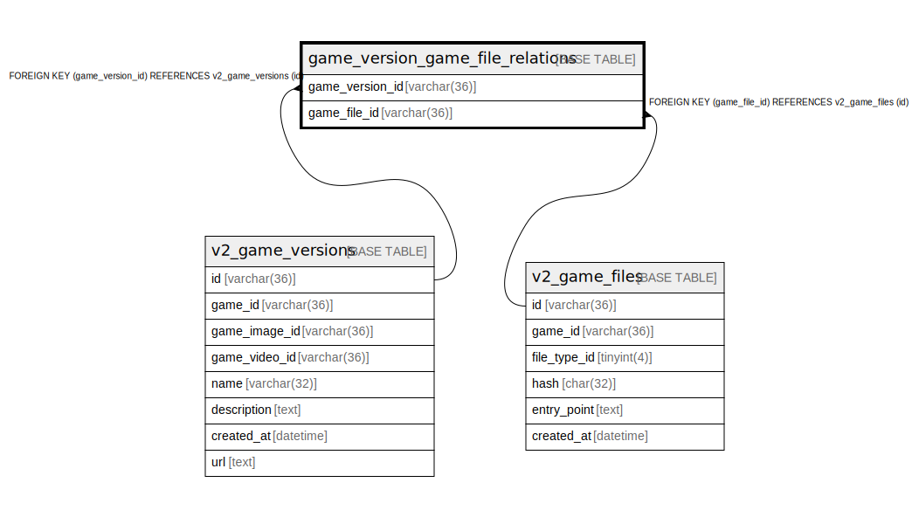

# game_version_game_file_relations

## Description

ゲームバージョンとゲームファイルの関係テーブル(v2)

<details>
<summary><strong>Table Definition</strong></summary>

```sql
CREATE TABLE `game_version_game_file_relations` (
  `game_version_id` varchar(36) NOT NULL,
  `game_file_id` varchar(36) NOT NULL,
  PRIMARY KEY (`game_version_id`,`game_file_id`),
  KEY `fk_game_version_game_file_relations_game_file_table2_v2` (`game_file_id`),
  CONSTRAINT `fk_game_version_game_file_relations_game_file_table2_v2` FOREIGN KEY (`game_file_id`) REFERENCES `v2_game_files` (`id`),
  CONSTRAINT `fk_game_version_game_file_relations_game_version_table2_v2` FOREIGN KEY (`game_version_id`) REFERENCES `v2_game_versions` (`id`)
) ENGINE=InnoDB DEFAULT CHARSET=utf8mb4
```

</details>

## Columns

| Name | Type | Default | Nullable | Children | Parents | Comment |
| ---- | ---- | ------- | -------- | -------- | ------- | ------- |
| game_version_id | varchar(36) |  | false |  | [v2_game_versions](v2_game_versions.md) | ゲームバージョンUUID |
| game_file_id | varchar(36) |  | false |  | [v2_game_files](v2_game_files.md) | ゲームファイルUUID |

## Constraints

| Name | Type | Definition |
| ---- | ---- | ---------- |
| fk_game_version_game_file_relations_game_file_table2_v2 | FOREIGN KEY | FOREIGN KEY (game_file_id) REFERENCES v2_game_files (id) |
| fk_game_version_game_file_relations_game_version_table2_v2 | FOREIGN KEY | FOREIGN KEY (game_version_id) REFERENCES v2_game_versions (id) |
| PRIMARY | PRIMARY KEY | PRIMARY KEY (game_version_id, game_file_id) |

## Indexes

| Name | Definition |
| ---- | ---------- |
| fk_game_version_game_file_relations_game_file_table2_v2 | KEY fk_game_version_game_file_relations_game_file_table2_v2 (game_file_id) USING BTREE |
| PRIMARY | PRIMARY KEY (game_version_id, game_file_id) USING BTREE |

## Relations



---

> Generated by [tbls](https://github.com/k1LoW/tbls)
