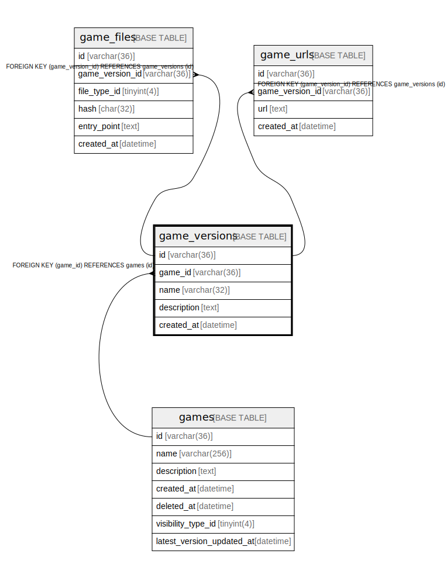

# game_versions

## Description

ゲームバージョンテーブル(v1)

<details>
<summary><strong>Table Definition</strong></summary>

```sql
CREATE TABLE `game_versions` (
  `id` varchar(36) NOT NULL,
  `game_id` varchar(36) NOT NULL,
  `name` varchar(32) NOT NULL,
  `description` text NOT NULL,
  `created_at` datetime NOT NULL DEFAULT current_timestamp(),
  PRIMARY KEY (`id`),
  KEY `fk_games_game_versions_v1` (`game_id`),
  CONSTRAINT `fk_games_game_versions_v1` FOREIGN KEY (`game_id`) REFERENCES `games` (`id`)
) ENGINE=InnoDB DEFAULT CHARSET=utf8mb4
```

</details>

## Columns

| Name | Type | Default | Nullable | Children | Parents | Comment |
| ---- | ---- | ------- | -------- | -------- | ------- | ------- |
| id | varchar(36) |  | false | [game_files](game_files.md) [game_urls](game_urls.md) |  | ゲームバージョンUUID |
| game_id | varchar(36) |  | false |  | [games](games.md) | ゲームUUID |
| name | varchar(32) |  | false |  |  | ゲームバージョン名 |
| description | text |  | false |  |  | ゲームバージョンの説明 |
| created_at | datetime | current_timestamp() | false |  |  | 作成日時 |

## Constraints

| Name | Type | Definition |
| ---- | ---- | ---------- |
| fk_games_game_versions_v1 | FOREIGN KEY | FOREIGN KEY (game_id) REFERENCES games (id) |
| PRIMARY | PRIMARY KEY | PRIMARY KEY (id) |

## Indexes

| Name | Definition |
| ---- | ---------- |
| fk_games_game_versions_v1 | KEY fk_games_game_versions_v1 (game_id) USING BTREE |
| PRIMARY | PRIMARY KEY (id) USING BTREE |

## Relations



---

> Generated by [tbls](https://github.com/k1LoW/tbls)
