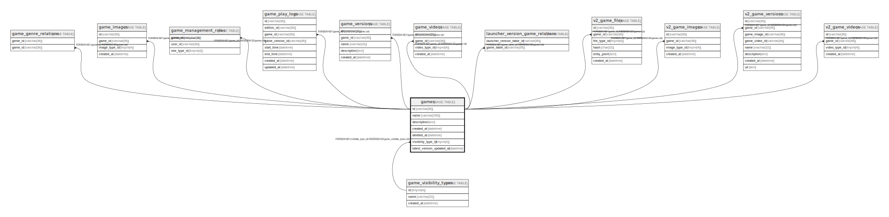

# games

## Description

ゲームテーブル

<details>
<summary><strong>Table Definition</strong></summary>

```sql
CREATE TABLE `games` (
  `id` varchar(36) NOT NULL,
  `name` varchar(256) NOT NULL,
  `description` text NOT NULL,
  `created_at` datetime NOT NULL DEFAULT current_timestamp(),
  `deleted_at` datetime DEFAULT NULL,
  `visibility_type_id` tinyint(4) NOT NULL,
  `latest_version_updated_at` datetime NOT NULL DEFAULT current_timestamp(),
  PRIMARY KEY (`id`),
  KEY `fk_games_game_visibility_type` (`visibility_type_id`),
  CONSTRAINT `fk_games_game_visibility_type` FOREIGN KEY (`visibility_type_id`) REFERENCES `game_visibility_types` (`id`)
) ENGINE=InnoDB DEFAULT CHARSET=utf8mb4
```

</details>

## Columns

| Name | Type | Default | Nullable | Children | Parents | Comment |
| ---- | ---- | ------- | -------- | -------- | ------- | ------- |
| id | varchar(36) |  | false | [game_genre_relations](game_genre_relations.md) [game_images](game_images.md) [game_management_roles](game_management_roles.md) [game_versions](game_versions.md) [game_videos](game_videos.md) [launcher_version_game_relations](launcher_version_game_relations.md) [v2_game_files](v2_game_files.md) [v2_game_images](v2_game_images.md) [v2_game_versions](v2_game_versions.md) [v2_game_videos](v2_game_videos.md) |  | ゲームUUID |
| name | varchar(256) |  | false |  |  | ゲーム名 |
| description | text |  | false |  |  | ゲームの説明 |
| created_at | datetime | current_timestamp() | false |  |  | 作成日時 |
| deleted_at | datetime | NULL | true |  |  | 削除日時 |
| visibility_type_id | tinyint(4) |  | false |  | [game_visibility_types](game_visibility_types.md) | ゲームの公開範囲のID |
| latest_version_updated_at | datetime | current_timestamp() | false |  |  |  |

## Constraints

| Name | Type | Definition |
| ---- | ---- | ---------- |
| fk_games_game_visibility_type | FOREIGN KEY | FOREIGN KEY (visibility_type_id) REFERENCES game_visibility_types (id) |
| PRIMARY | PRIMARY KEY | PRIMARY KEY (id) |

## Indexes

| Name | Definition |
| ---- | ---------- |
| fk_games_game_visibility_type | KEY fk_games_game_visibility_type (visibility_type_id) USING BTREE |
| PRIMARY | PRIMARY KEY (id) USING BTREE |

## Relations



---

> Generated by [tbls](https://github.com/k1LoW/tbls)
