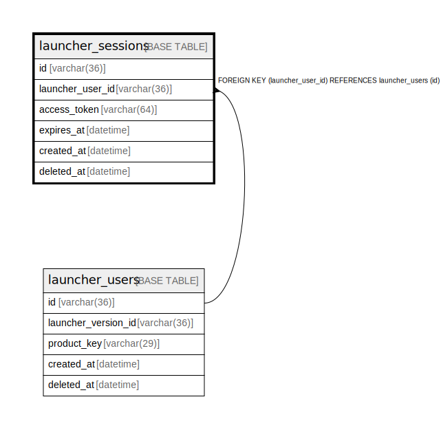

# launcher_sessions

## Description

ランチャーセッションテーブル(v1)

<details>
<summary><strong>Table Definition</strong></summary>

```sql
CREATE TABLE `launcher_sessions` (
  `id` varchar(36) NOT NULL,
  `launcher_user_id` varchar(36) NOT NULL,
  `access_token` varchar(64) NOT NULL,
  `expires_at` datetime NOT NULL,
  `created_at` datetime NOT NULL DEFAULT current_timestamp(),
  `deleted_at` datetime DEFAULT NULL,
  PRIMARY KEY (`id`),
  UNIQUE KEY `access_token` (`access_token`),
  KEY `fk_launcher_users_launcher_sessions` (`launcher_user_id`),
  CONSTRAINT `fk_launcher_users_launcher_sessions` FOREIGN KEY (`launcher_user_id`) REFERENCES `launcher_users` (`id`)
) ENGINE=InnoDB DEFAULT CHARSET=utf8mb4
```

</details>

## Columns

| Name | Type | Default | Nullable | Children | Parents | Comment |
| ---- | ---- | ------- | -------- | -------- | ------- | ------- |
| id | varchar(36) |  | false |  |  | ランチャーセッションUUID |
| launcher_user_id | varchar(36) |  | false |  | [launcher_users](launcher_users.md) | ランチャーユーザーUUID |
| access_token | varchar(64) |  | false |  |  | アクセストークンの値 |
| expires_at | datetime |  | false |  |  | 有効期限 |
| created_at | datetime | current_timestamp() | false |  |  | 作成日時 |
| deleted_at | datetime | NULL | true |  |  | revokeされた日時 |

## Constraints

| Name | Type | Definition |
| ---- | ---- | ---------- |
| access_token | UNIQUE | UNIQUE KEY access_token (access_token) |
| fk_launcher_users_launcher_sessions | FOREIGN KEY | FOREIGN KEY (launcher_user_id) REFERENCES launcher_users (id) |
| PRIMARY | PRIMARY KEY | PRIMARY KEY (id) |

## Indexes

| Name | Definition |
| ---- | ---------- |
| fk_launcher_users_launcher_sessions | KEY fk_launcher_users_launcher_sessions (launcher_user_id) USING BTREE |
| PRIMARY | PRIMARY KEY (id) USING BTREE |
| access_token | UNIQUE KEY access_token (access_token) USING BTREE |

## Relations



---

> Generated by [tbls](https://github.com/k1LoW/tbls)
