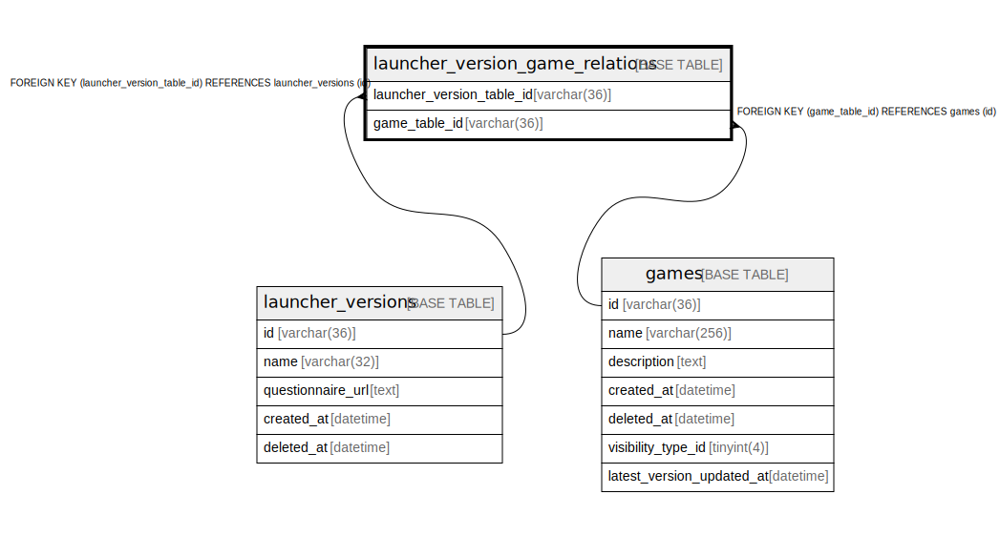

# launcher_version_game_relations

## Description

ランチャーバージョンとゲームの関係テーブル(v1)

<details>
<summary><strong>Table Definition</strong></summary>

```sql
CREATE TABLE `launcher_version_game_relations` (
  `launcher_version_table_id` varchar(36) NOT NULL,
  `game_table_id` varchar(36) NOT NULL,
  PRIMARY KEY (`launcher_version_table_id`,`game_table_id`),
  KEY `fk_launcher_version_game_relations_game_table_v1` (`game_table_id`),
  CONSTRAINT `fk_launcher_version_game_relations_game_table_v1` FOREIGN KEY (`game_table_id`) REFERENCES `games` (`id`),
  CONSTRAINT `fk_launcher_version_game_relations_launcher_version_table_v1` FOREIGN KEY (`launcher_version_table_id`) REFERENCES `launcher_versions` (`id`)
) ENGINE=InnoDB DEFAULT CHARSET=utf8mb4
```

</details>

## Columns

| Name | Type | Default | Nullable | Children | Parents | Comment |
| ---- | ---- | ------- | -------- | -------- | ------- | ------- |
| launcher_version_table_id | varchar(36) |  | false |  | [launcher_versions](launcher_versions.md) | ランチャーバージョンUUID |
| game_table_id | varchar(36) |  | false |  | [games](games.md) | ゲームUUID |

## Constraints

| Name | Type | Definition |
| ---- | ---- | ---------- |
| fk_launcher_version_game_relations_game_table_v1 | FOREIGN KEY | FOREIGN KEY (game_table_id) REFERENCES games (id) |
| fk_launcher_version_game_relations_launcher_version_table_v1 | FOREIGN KEY | FOREIGN KEY (launcher_version_table_id) REFERENCES launcher_versions (id) |
| PRIMARY | PRIMARY KEY | PRIMARY KEY (launcher_version_table_id, game_table_id) |

## Indexes

| Name | Definition |
| ---- | ---------- |
| fk_launcher_version_game_relations_game_table_v1 | KEY fk_launcher_version_game_relations_game_table_v1 (game_table_id) USING BTREE |
| PRIMARY | PRIMARY KEY (launcher_version_table_id, game_table_id) USING BTREE |

## Relations



---

> Generated by [tbls](https://github.com/k1LoW/tbls)
