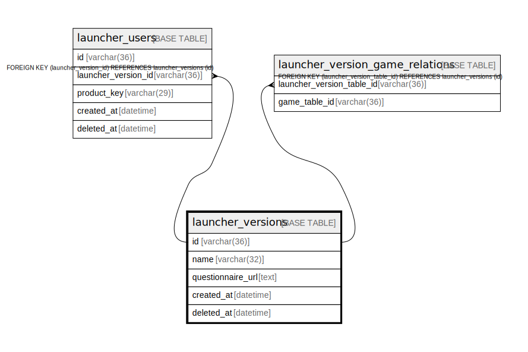

# launcher_versions

## Description

ランチャーバージョンテーブル(v1)

<details>
<summary><strong>Table Definition</strong></summary>

```sql
CREATE TABLE `launcher_versions` (
  `id` varchar(36) NOT NULL,
  `name` varchar(32) NOT NULL,
  `questionnaire_url` text DEFAULT NULL,
  `created_at` datetime NOT NULL DEFAULT current_timestamp(),
  `deleted_at` datetime DEFAULT NULL,
  PRIMARY KEY (`id`),
  UNIQUE KEY `uni_launcher_versions_name` (`name`)
) ENGINE=InnoDB DEFAULT CHARSET=utf8mb4
```

</details>

## Columns

| Name | Type | Default | Nullable | Children | Parents | Comment |
| ---- | ---- | ------- | -------- | -------- | ------- | ------- |
| id | varchar(36) |  | false | [launcher_users](launcher_users.md) [launcher_version_game_relations](launcher_version_game_relations.md) |  | ランチャーバージョンUUID |
| name | varchar(32) |  | false |  |  | ランチャーバージョン名 |
| questionnaire_url | text | NULL | true |  |  | アンケートURL |
| created_at | datetime | current_timestamp() | false |  |  | 作成日時 |
| deleted_at | datetime | NULL | true |  |  | 削除日時 |

## Constraints

| Name | Type | Definition |
| ---- | ---- | ---------- |
| PRIMARY | PRIMARY KEY | PRIMARY KEY (id) |
| uni_launcher_versions_name | UNIQUE | UNIQUE KEY uni_launcher_versions_name (name) |

## Indexes

| Name | Definition |
| ---- | ---------- |
| PRIMARY | PRIMARY KEY (id) USING BTREE |
| uni_launcher_versions_name | UNIQUE KEY uni_launcher_versions_name (name) USING BTREE |

## Relations



---

> Generated by [tbls](https://github.com/k1LoW/tbls)
