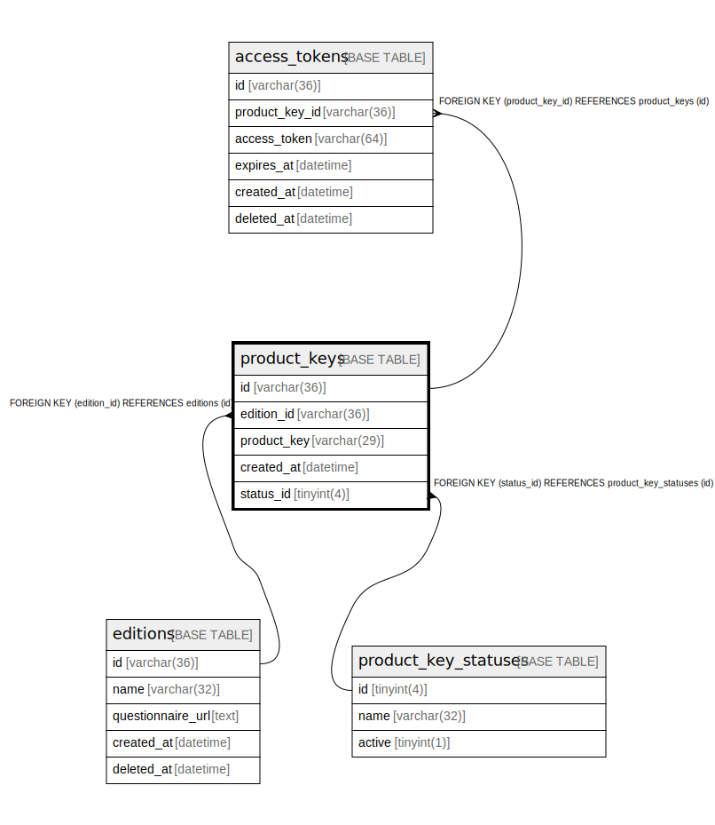

# product_keys

## Description

プロダクトキーテーブル(v2)

<details>
<summary><strong>Table Definition</strong></summary>

```sql
CREATE TABLE `product_keys` (
  `id` varchar(36) NOT NULL,
  `edition_id` varchar(36) NOT NULL,
  `product_key` varchar(29) NOT NULL,
  `created_at` datetime NOT NULL DEFAULT current_timestamp(),
  `deleted_at` datetime DEFAULT NULL,
  PRIMARY KEY (`id`),
  UNIQUE KEY `product_key` (`product_key`),
  KEY `fk_editions_product_keys` (`edition_id`),
  CONSTRAINT `fk_editions_product_keys` FOREIGN KEY (`edition_id`) REFERENCES `editions` (`id`)
) ENGINE=InnoDB DEFAULT CHARSET=utf8mb4
```

</details>

## Columns

| Name | Type | Default | Nullable | Children | Parents | Comment |
| ---- | ---- | ------- | -------- | -------- | ------- | ------- |
| id | varchar(36) |  | false | [access_tokens](access_tokens.md) |  | プロダクトキーUUID |
| edition_id | varchar(36) |  | false |  | [editions](editions.md) | エディションUUID |
| product_key | varchar(29) |  | false |  |  | プロダクトキーの値 |
| created_at | datetime | current_timestamp() | false |  |  | 作成日時 |
| deleted_at | datetime | NULL | true |  |  | revokeされた日時 |

## Constraints

| Name | Type | Definition |
| ---- | ---- | ---------- |
| fk_editions_product_keys | FOREIGN KEY | FOREIGN KEY (edition_id) REFERENCES editions (id) |
| PRIMARY | PRIMARY KEY | PRIMARY KEY (id) |
| product_key | UNIQUE | UNIQUE KEY product_key (product_key) |

## Indexes

| Name | Definition |
| ---- | ---------- |
| fk_editions_product_keys | KEY fk_editions_product_keys (edition_id) USING BTREE |
| PRIMARY | PRIMARY KEY (id) USING BTREE |
| product_key | UNIQUE KEY product_key (product_key) USING BTREE |

## Relations



---

> Generated by [tbls](https://github.com/k1LoW/tbls)
