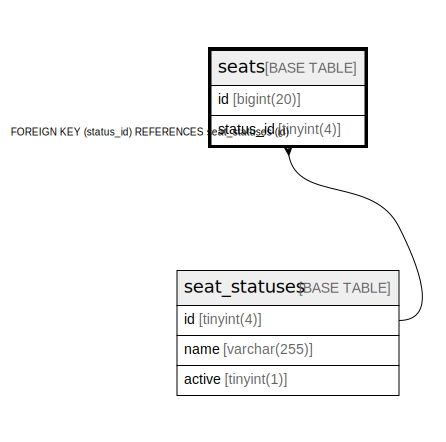

# seats

## Description

<details>
<summary><strong>Table Definition</strong></summary>

```sql
CREATE TABLE `seats` (
  `id` bigint(20) NOT NULL AUTO_INCREMENT,
  `status_id` tinyint(4) NOT NULL,
  PRIMARY KEY (`id`),
  KEY `fk_seats_seat_status` (`status_id`),
  CONSTRAINT `fk_seats_seat_status` FOREIGN KEY (`status_id`) REFERENCES `seat_statuses` (`id`)
) ENGINE=InnoDB DEFAULT CHARSET=utf8mb4
```

</details>

## Columns

| Name | Type | Default | Nullable | Extra Definition | Children | Parents | Comment |
| ---- | ---- | ------- | -------- | ---------------- | -------- | ------- | ------- |
| id | bigint(20) |  | false | auto_increment |  |  |  |
| status_id | tinyint(4) |  | false |  |  | [seat_statuses](seat_statuses.md) |  |

## Constraints

| Name | Type | Definition |
| ---- | ---- | ---------- |
| fk_seats_seat_status | FOREIGN KEY | FOREIGN KEY (status_id) REFERENCES seat_statuses (id) |
| PRIMARY | PRIMARY KEY | PRIMARY KEY (id) |

## Indexes

| Name | Definition |
| ---- | ---------- |
| fk_seats_seat_status | KEY fk_seats_seat_status (status_id) USING BTREE |
| PRIMARY | PRIMARY KEY (id) USING BTREE |

## Relations



---

> Generated by [tbls](https://github.com/k1LoW/tbls)
