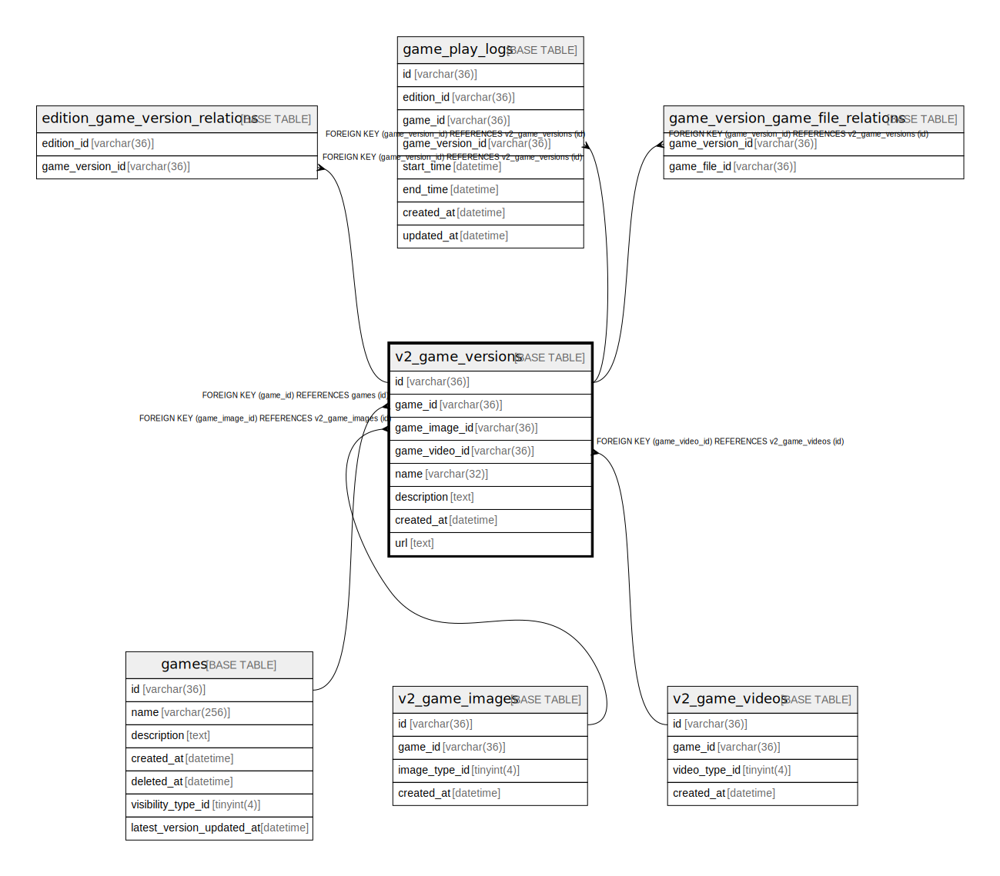

# v2_game_versions

## Description

ゲームバージョンテーブル(v2)

<details>
<summary><strong>Table Definition</strong></summary>

```sql
CREATE TABLE `v2_game_versions` (
  `id` varchar(36) NOT NULL,
  `game_id` varchar(36) NOT NULL,
  `game_image_id` varchar(36) NOT NULL,
  `game_video_id` varchar(36) NOT NULL,
  `name` varchar(32) NOT NULL,
  `description` text NOT NULL,
  `created_at` datetime NOT NULL DEFAULT current_timestamp(),
  `url` text DEFAULT NULL,
  PRIMARY KEY (`id`),
  UNIQUE KEY `idx_game_id_name` (`game_id`,`name`),
  KEY `fk_v2_game_versions_game_image` (`game_image_id`),
  KEY `fk_v2_game_versions_game_video` (`game_video_id`),
  CONSTRAINT `fk_games_game_versions_v2` FOREIGN KEY (`game_id`) REFERENCES `games` (`id`),
  CONSTRAINT `fk_v2_game_versions_game_image` FOREIGN KEY (`game_image_id`) REFERENCES `v2_game_images` (`id`),
  CONSTRAINT `fk_v2_game_versions_game_video` FOREIGN KEY (`game_video_id`) REFERENCES `v2_game_videos` (`id`)
) ENGINE=InnoDB DEFAULT CHARSET=utf8mb4
```

</details>

## Columns

| Name | Type | Default | Nullable | Children | Parents | Comment |
| ---- | ---- | ------- | -------- | -------- | ------- | ------- |
| id | varchar(36) |  | false | [edition_game_version_relations](edition_game_version_relations.md) [game_version_game_file_relations](game_version_game_file_relations.md) |  | ゲームバージョンUUID |
| game_id | varchar(36) |  | false |  | [games](games.md) | ゲームUUID |
| game_image_id | varchar(36) |  | false |  | [v2_game_images](v2_game_images.md) | ゲーム画像UUID |
| game_video_id | varchar(36) |  | false |  | [v2_game_videos](v2_game_videos.md) | ゲーム動画UUID |
| name | varchar(32) |  | false |  |  | ゲームバージョン名 |
| description | text |  | false |  |  | ゲームバージョンの説明 |
| created_at | datetime | current_timestamp() | false |  |  | 作成日時 |
| url | text | NULL | true |  |  |  |

## Constraints

| Name | Type | Definition |
| ---- | ---- | ---------- |
| fk_games_game_versions_v2 | FOREIGN KEY | FOREIGN KEY (game_id) REFERENCES games (id) |
| fk_v2_game_versions_game_image | FOREIGN KEY | FOREIGN KEY (game_image_id) REFERENCES v2_game_images (id) |
| fk_v2_game_versions_game_video | FOREIGN KEY | FOREIGN KEY (game_video_id) REFERENCES v2_game_videos (id) |
| idx_game_id_name | UNIQUE | UNIQUE KEY idx_game_id_name (game_id, name) |
| PRIMARY | PRIMARY KEY | PRIMARY KEY (id) |

## Indexes

| Name | Definition |
| ---- | ---------- |
| fk_v2_game_versions_game_image | KEY fk_v2_game_versions_game_image (game_image_id) USING BTREE |
| fk_v2_game_versions_game_video | KEY fk_v2_game_versions_game_video (game_video_id) USING BTREE |
| PRIMARY | PRIMARY KEY (id) USING BTREE |
| idx_game_id_name | UNIQUE KEY idx_game_id_name (game_id, name) USING BTREE |

## Relations



---

> Generated by [tbls](https://github.com/k1LoW/tbls)
