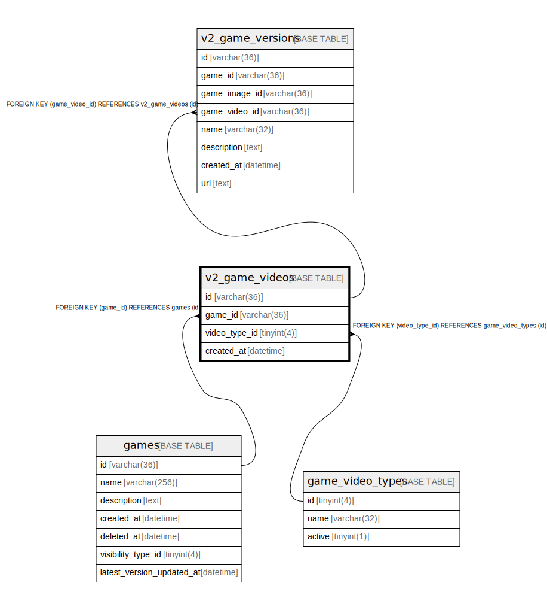

# v2_game_videos

## Description

ゲーム動画テーブル(v2)

<details>
<summary><strong>Table Definition</strong></summary>

```sql
CREATE TABLE `v2_game_videos` (
  `id` varchar(36) NOT NULL,
  `game_id` varchar(36) NOT NULL,
  `video_type_id` tinyint(4) NOT NULL,
  `created_at` datetime NOT NULL DEFAULT current_timestamp(),
  PRIMARY KEY (`id`),
  KEY `fk_games_game_video2s` (`game_id`),
  KEY `fk_v2_game_videos_game_video_type` (`video_type_id`),
  CONSTRAINT `fk_games_game_video2s` FOREIGN KEY (`game_id`) REFERENCES `games` (`id`),
  CONSTRAINT `fk_v2_game_videos_game_video_type` FOREIGN KEY (`video_type_id`) REFERENCES `game_video_types` (`id`)
) ENGINE=InnoDB DEFAULT CHARSET=utf8mb4
```

</details>

## Columns

| Name | Type | Default | Nullable | Children | Parents | Comment |
| ---- | ---- | ------- | -------- | -------- | ------- | ------- |
| id | varchar(36) |  | false | [v2_game_versions](v2_game_versions.md) |  | ゲーム動画UUID |
| game_id | varchar(36) |  | false |  | [games](games.md) | ゲームUUID |
| video_type_id | tinyint(4) |  | false |  | [game_video_types](game_video_types.md) | 動画の種類のUUID |
| created_at | datetime | current_timestamp() | false |  |  | 作成日時 |

## Constraints

| Name | Type | Definition |
| ---- | ---- | ---------- |
| fk_games_game_video2s | FOREIGN KEY | FOREIGN KEY (game_id) REFERENCES games (id) |
| fk_v2_game_videos_game_video_type | FOREIGN KEY | FOREIGN KEY (video_type_id) REFERENCES game_video_types (id) |
| PRIMARY | PRIMARY KEY | PRIMARY KEY (id) |

## Indexes

| Name | Definition |
| ---- | ---------- |
| fk_games_game_video2s | KEY fk_games_game_video2s (game_id) USING BTREE |
| fk_v2_game_videos_game_video_type | KEY fk_v2_game_videos_game_video_type (video_type_id) USING BTREE |
| PRIMARY | PRIMARY KEY (id) USING BTREE |

## Relations



---

> Generated by [tbls](https://github.com/k1LoW/tbls)
