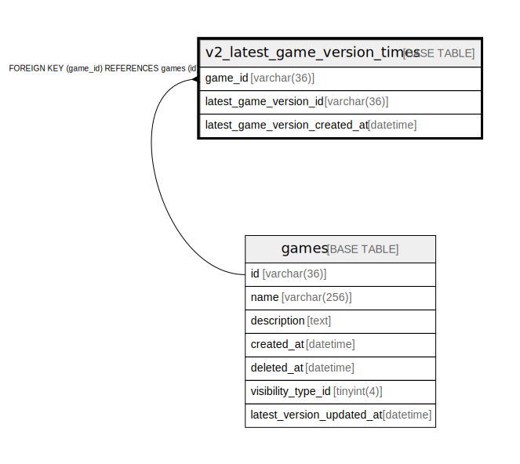

# v2_latest_game_version_times

## Description

<details>
<summary><strong>Table Definition</strong></summary>

```sql
CREATE TABLE `v2_latest_game_version_times` (
  `game_id` varchar(36) NOT NULL,
  `latest_game_version_id` varchar(36) NOT NULL,
  `latest_game_version_created_at` datetime NOT NULL,
  PRIMARY KEY (`game_id`),
  KEY `idx_game_version_stats_latest_created_at` (`latest_game_version_created_at`),
  CONSTRAINT `fk_v2_latest_game_version_times_games` FOREIGN KEY (`game_id`) REFERENCES `games` (`id`) ON DELETE CASCADE ON UPDATE CASCADE
) ENGINE=InnoDB DEFAULT CHARSET=utf8mb4
```

</details>

## Columns

| Name | Type | Default | Nullable | Children | Parents | Comment |
| ---- | ---- | ------- | -------- | -------- | ------- | ------- |
| game_id | varchar(36) |  | false |  | [games](games.md) |  |
| latest_game_version_id | varchar(36) |  | false |  |  |  |
| latest_game_version_created_at | datetime |  | false |  |  |  |

## Constraints

| Name | Type | Definition |
| ---- | ---- | ---------- |
| fk_v2_latest_game_version_times_games | FOREIGN KEY | FOREIGN KEY (game_id) REFERENCES games (id) |
| PRIMARY | PRIMARY KEY | PRIMARY KEY (game_id) |

## Indexes

| Name | Definition |
| ---- | ---------- |
| idx_game_version_stats_latest_created_at | KEY idx_game_version_stats_latest_created_at (latest_game_version_created_at) USING BTREE |
| PRIMARY | PRIMARY KEY (game_id) USING BTREE |

## Relations



---

> Generated by [tbls](https://github.com/k1LoW/tbls)
