# srcディレクトリ

理解の助けになるかもしれないもの
- https://wiki.trap.jp/user/mazrean/memo/%E8%A8%AD%E8%A8%88%E3%81%A8%E3%83%87%E3%82%A3%E3%83%AC%E3%82%AF%E3%83%88%E3%83%AA%E6%A7%8B%E9%80%A0
- https://slides.mazrean.com/ddd/

## 変更する際のルール

これに従えば、現状の設計を保つことができる実装になっている。

- 常にinterfaceに実装は従う。
  つまり、実装を理由にinterfaceが変わることはない。
- interfaceはpackage間の依存の直接または間接的な依存が変更された場合にのみ変更される。

## 各package(ディレクトリ)の役割

- domain: アプリケーション全体で共通するルール。
- config: アプリケーションの設定。現在はDBの接続情報などを環境変数から読み取っている。
- service: アプリケーションのロジック。
- auth: traQを用いた認証。
- cache: オンメモリキャッシュ。現在は[ristretto](https://github.com/dgraph-io/ristretto)を使用した実装を使っている。
- repository: データの永続化。RDBMSの範囲での抽象化になっている。現在はGORM2でMySQLを使用する実装を使っている。
- handler: REST API。現在はOpenAPI Generatorによるコード生成を使ったv1実装を使っている。
- storage: ファイルなどのデータの格納。現在は[ncs/swift](https://github.com/ncw/swift/v2)、OpenStack Swift互換のObject Storageを使う実装を使っている。
- wire: DI。各要素をDIにより繋ぎ合わせる。

## package間の依存関係

全体

Application内

